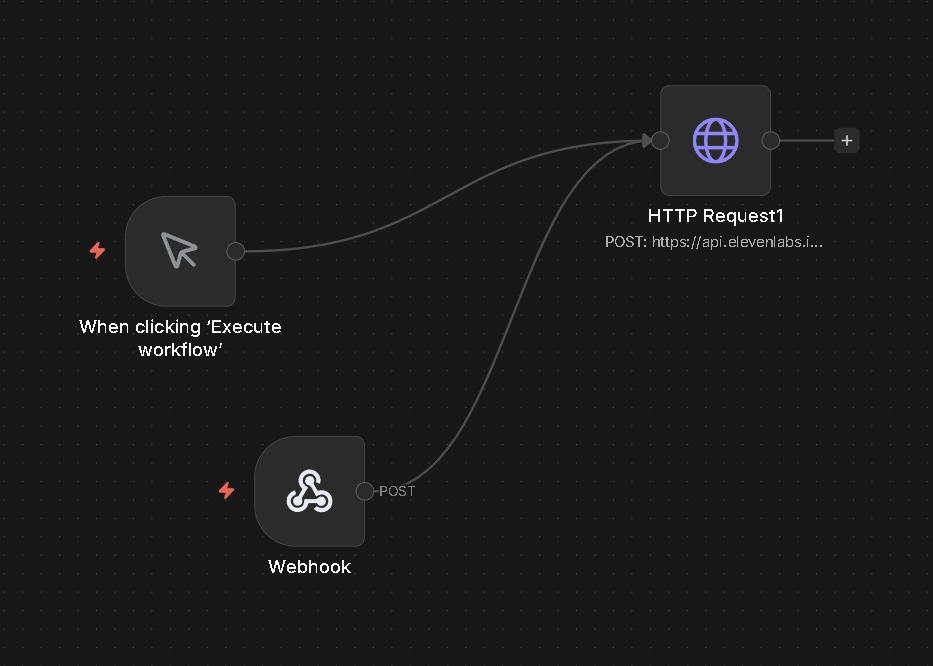
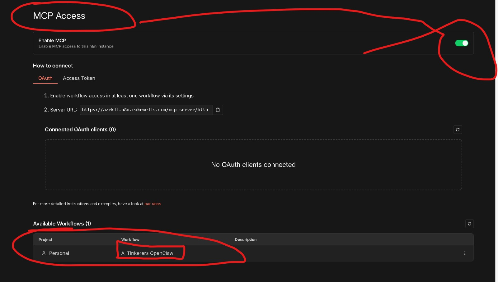

# AURIA

**A**ccessible **U**nified **R**esponse **I**ntelligence **A**ssistant

A Proof of Concept built at the **OpenClaw Global Unhackathon São Paulo**.

## Overview

**Smart protection for the ones you love.**

AURIA is a voice-activated AI security system designed to protect women, the elderly, and children. It enables discreet emergency alerts through Telegram, using AI to interpret voice messages and automatically trigger phone calls to trusted contacts.

### The Problem

Victims of violence often cannot call for help through conventional means in the moment of danger. Traditional safety apps require pressing panic buttons or downloading dedicated apps, which may not be accessible in critical situations.

### The Solution

AURIA provides a discreet, voice-activated digital guardian that:
- **Voice Activation**: Just speak - no buttons to press
- **No Extra App**: Uses Telegram (already installed on most phones)
- **Humanized Call**: Realistic AI voice via ElevenLabs
- **Instant Response**: From voice to rescue in seconds

## Architecture

```
┌──────────────┐     ┌──────────────┐     ┌──────────────┐     ┌──────────────┐     ┌──────────────┐
│   Telegram   │────▶│   OpenClaw   │────▶│   N8N MCP    │────▶│    Twilio    │────▶│  ElevenLabs  │
│   (Input)    │     │   (Router)   │     │  (Workflow)  │     │   (Voice)    │     │    (TTS)     │
└──────────────┘     └──────────────┘     └──────────────┘     └──────────────┘     └──────────────┘
```

## Technical Stack

### 1. Telegram (Input Layer)
- **Purpose**: User interface for receiving messages
- **Role**: Entry point for user interactions
- **Input Types**: Text messages or audio messages
- **Integration**: Bot API for message handling

### 2. OpenClaw (Router Layer)
- **Purpose**: AI routing and orchestration
- **Role**: Processes incoming messages and routes to appropriate workflows
- **Audio Processing**: Whisper + ffmpeg for speech-to-text transcription
- **LLM**: Uses OpenAI API as the language model backend
- **MCP Integration**: Uses the `mcporter` skill for MCP server calls
- **Features**:
  - Natural language understanding
  - Intent classification
  - Context management

### 3. N8N MCP Workflow (Orchestration Layer)
- **Purpose**: Workflow automation and MCP (Model Context Protocol) integration
- **Role**: Orchestrates the flow between services
- **Features**:
  - Visual workflow builder
  - MCP server integration
  - Custom logic execution
  - API integrations

### 4. Twilio (Communication Layer)
- **Purpose**: Voice call handling
- **Role**: Manages outbound voice calls and telephony features
- **Features**:
  - Programmable voice
  - Call routing
  - Real-time audio streaming

### 5. ElevenLabs (Voice Synthesis Layer)
- **Purpose**: Text-to-Speech generation
- **Role**: Converts AI responses into natural-sounding voice
- **Features**:
  - High-quality voice synthesis
  - Multiple voice options
  - Low-latency streaming

## Data Flow

1. **User Input**: User sends a message via Telegram
2. **Processing**: OpenClaw receives and processes the message
3. **Workflow Execution**: N8N MCP workflow handles business logic
4. **Voice Call**: Twilio initiates or handles voice communication
5. **Speech Synthesis**: ElevenLabs generates natural voice output

## Setup

### Prerequisites
- Telegram Bot Token
- Whisper + ffmpeg (for audio transcription)
- OpenClaw API access
- OpenAI API key (LLM backend for OpenClaw)
- N8N instance with MCP support
- Twilio account (Account SID + Auth Token)
- ElevenLabs API key

### Environment Variables

```env
# Telegram
TELEGRAM_BOT_TOKEN=your_telegram_bot_token

# OpenClaw
OPENCLAW_API_KEY=your_openclaw_api_key
OPENCLAW_ENDPOINT=https://api.openclaw.com

# OpenAI (LLM for OpenClaw)
OPENAI_API_KEY=your_openai_api_key

# N8N
N8N_WEBHOOK_URL=your_n8n_webhook_url
N8N_MCP_ENDPOINT=your_mcp_endpoint

# Twilio
TWILIO_ACCOUNT_SID=your_twilio_account_sid
TWILIO_AUTH_TOKEN=your_twilio_auth_token
TWILIO_PHONE_NUMBER=your_twilio_phone_number

# ElevenLabs
ELEVENLABS_API_KEY=your_elevenlabs_api_key
ELEVENLABS_VOICE_ID=your_preferred_voice_id
```

## Use Cases

- **Accessibility**: Voice-enabled assistance for users with visual impairments
- **Elderly Care**: Simple voice interface for non-technical users
- **Customer Service**: Automated voice responses via messaging triggers
- **Emergency Notifications**: Voice alerts triggered by chat commands

## Demo & Context

### Pitch Deck
Full presentation explaining the problem, solution, and vision.


### Telegram Audio Processing
User sends an audio message to the OpenClaw bot. The AI transcribes the audio using Whisper, interprets the intent, and triggers the N8N workflow to initiate an emergency call.


### N8N Workflow
The workflow receives webhook calls from OpenClaw and makes HTTP requests to ElevenLabs API for voice generation.



### N8N MCP Server Configuration
MCP Access configuration showing the server URL and the "AI Tinkerers OpenClaw" workflow available for execution.



### AURIA Calling Demo
Video demonstration of AURIA making an automated emergency call with AI-generated voice.


## Contributing

This project was created during the OpenClaw Global Unhackathon São Paulo. Contributions are welcome!

## License

MIT License

## Team

Built with passion at **OpenClaw Global Unhackathon São Paulo** 2026

- [Ricardo Kerr](https://www.linkedin.com/in/ricardo-kerr-oficial/)
- [Renato Rodrigues](https://www.linkedin.com/in/renatorodriguess/)
- [Thiago Medeiro](https://www.linkedin.com/in/tfmedeiro/)
- [Rodrigo Silvacio](https://www.linkedin.com/in/rodrigosilvacio/)
- [William Antero](https://www.linkedin.com/in/wantero/)
